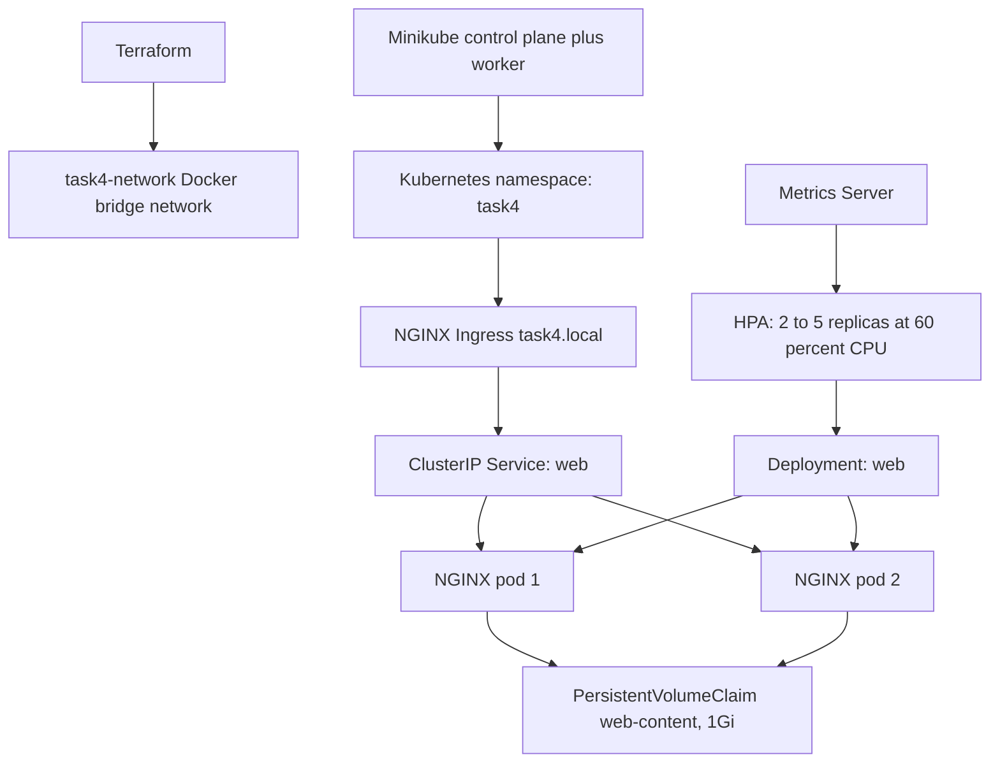

# Task 4: Automated Infrastructure as Code and Orchestration

A completely local, cost-free implementation of the Task 4 mini project. It provisions an isolated Docker network with Terraform and deploys a replicated NGINX workload to a two-node Minikube Kubernetes cluster.

The project demonstrates:

- Declarative Infrastructure as Code with Terraform
- An isolated local network
- A multi-node Kubernetes environment
- A containerized application with two replicas
- Persistent storage through a Kubernetes PersistentVolumeClaim
- HTTP routing through the NGINX Ingress controller
- CPU-based Horizontal Pod Autoscaling from two to five replicas

No AWS, Azure, GCP, paid Kubernetes service, paid registry, or cloud account is required.

## Architecture



### Request flow

1. A browser requests `http://task4.local`.
2. The Minikube NGINX Ingress controller receives the request.
3. The Ingress forwards traffic to the `web` ClusterIP Service.
4. Kubernetes load-balances the request across the NGINX pods.
5. The HPA uses Metrics Server CPU data to adjust the Deployment replica count.

## Project structure

```text
task4/
|-- terraform/
|   |-- main.tf             # Docker provider and isolated bridge network
|   |-- variables.tf        # Configurable network name
|   |-- outputs.tf          # Terraform output for the network name
|   `-- .terraform.lock.hcl # Locked Docker provider version
|-- k8s/
|   |-- namespace.yaml      # Isolated Kubernetes namespace
|   |-- pvc.yaml            # 1Gi persistent volume claim
|   |-- deployment.yaml     # NGINX Deployment, probes, resources, PVC mount
|   |-- service.yaml        # Internal ClusterIP service
|   |-- ingress.yaml        # task4.local HTTP route
|   `-- hpa.yaml            # CPU autoscaling from 2 to 5 pods
|-- .gitignore
|-- README.md
`-- task.md
```

## Prerequisites

- Docker Desktop
- Minikube
- kubectl
- Terraform

## 1. Create the isolated network

From PowerShell:

```powershell
cd terraform
terraform init
terraform fmt -check
terraform apply
cd ..
```

Terraform creates the `task4-network` Docker bridge network as the local network layer.

## 2. Start Kubernetes locally

```powershell
minikube start --driver=docker --nodes=2
minikube addons enable ingress
minikube addons enable metrics-server
```

## 3. Deploy the application stack

```powershell
kubectl apply -f k8s/namespace.yaml
kubectl apply -f k8s/pvc.yaml
kubectl apply -f k8s/deployment.yaml
kubectl apply -f k8s/service.yaml
kubectl apply -f k8s/ingress.yaml
kubectl apply -f k8s/hpa.yaml
```

Check the resources:

```powershell
kubectl get all,pvc,ingress,hpa -n task4
```

## 4. Test the Ingress endpoint

In a separate administrator PowerShell window, run:

```powershell
minikube tunnel
```

Add this entry to `C:\Windows\System32\drivers\etc\hosts`:

```text
127.0.0.1 task4.local
```

Then open `http://task4.local` in a browser or run:

```powershell
curl.exe http://task4.local
```

## 5. Verify HPA and storage

```powershell
kubectl get hpa -n task4
kubectl describe pvc web-content -n task4
kubectl get pods -n task4 -o wide
```

The HPA needs the metrics-server a short time before CPU values appear. The deployment starts with two replicas and can scale to five. The PVC is mounted at `/usr/share/nginx/html/data` inside each pod.

## Mapping to the assignment

| Requirement | Local implementation |
| --- | --- |
| Declarative IaC | Terraform in `terraform/` |
| Isolated network | Docker bridge network `task4-network` |
| Kubernetes cluster | Two-node Minikube cluster |
| Containerized application | NGINX deployment |
| Persistent volume claim | `k8s/pvc.yaml` |
| Ingress endpoint | NGINX Ingress at `task4.local` |
| Horizontal autoscaling | CPU-based HPA, 2 to 5 replicas |

This demonstrates the requested behavior locally. It simulates cloud elasticity and high availability; it does not create cloud worker nodes or cloud storage.

## Requirements

Install these free local tools on Windows:

- [Docker Desktop](https://www.docker.com/products/docker-desktop/)
- [Minikube](https://minikube.sigs.k8s.io/docs/start/)
- [kubectl](https://kubernetes.io/docs/tasks/tools/)
- [Terraform](https://developer.hashicorp.com/terraform/install)

PowerShell installation with WinGet:

```powershell
winget install Docker.DockerDesktop
winget install Kubernetes.minikube
winget install Kubernetes.kubectl
winget install Hashicorp.Terraform
```

Start Docker Desktop first, then verify the tools:

```powershell
docker version
minikube version
kubectl version --client
terraform version
```

## Resource details

### Terraform network

Terraform uses the Docker provider to create the `task4-network` bridge network. This is the local equivalent of an isolated VPC or VNet network boundary.

```hcl
resource "docker_network" "task4" {
	name   = var.network_name
	driver = "bridge"
}
```

Inspect it with:

```powershell
docker network inspect task4-network
```

### Kubernetes Deployment

The `web` Deployment uses `nginx:1.27-alpine` and starts two replicas. Each pod has CPU and memory requests and limits, readiness and liveness probes, and a mount at `/usr/share/nginx/html/data`.

Resource requests are required for meaningful CPU-based HPA calculations.

### Service and Ingress

The Service is internal to the cluster and listens on port 80. The Ingress exposes it using:

```text
Host: task4.local
Path: /
Service: web:80
Ingress class: nginx
```

### Persistent storage

The `web-content` PVC requests `1Gi` using `ReadWriteOnce`. Minikube's default storage provisioner supplies the local PersistentVolume automatically.

The PVC is mounted into both replicas at `/usr/share/nginx/html/data`.

### Horizontal Pod Autoscaler

The HPA targets the `web` Deployment:

```text
Minimum replicas: 2
Maximum replicas: 5
CPU target: 60 percent average utilization
Scale-down stabilization: 60 seconds
```

The HPA may initially display `<unknown>` while Metrics Server starts. Wait until `kubectl top pods -n task4` returns values.

## Demonstrate autoscaling

In one terminal, watch the HPA:

```powershell
kubectl get hpa -n task4 --watch
```

In another terminal, generate load through the Kubernetes Service:

```powershell
kubectl run load-generator -n task4 --image=busybox:1.36 --restart=Never -- /bin/sh -c "while true; do wget -q -O- http://web; done"
```

Inspect the replica count:

```powershell
kubectl get deployment,pods,hpa -n task4
```

Remove the test pod afterward:

```powershell
kubectl delete pod load-generator -n task4
```

## Assignment coverage

| Task requirement | Implementation | Evidence command |
| --- | --- | --- |
| Elastic, highly available cluster | Two Minikube nodes and two NGINX replicas | `kubectl get pods -n task4 -o wide` |
| Declarative Infrastructure as Code | Terraform Docker provider | `terraform/main.tf` |
| Isolated network | `task4-network` Docker bridge network | `docker network inspect task4-network` |
| Containerized application stack | NGINX container in a Deployment | `kubectl get deployment -n task4` |
| Kubernetes cluster | Two-node Minikube cluster | `minikube status` |
| Persistent volume claim | `web-content`, 1Gi, `ReadWriteOnce` | `kubectl get pvc -n task4` |
| Ingress controller endpoint | NGINX Ingress at `task4.local` | `kubectl describe ingress web -n task4` |
| Horizontal Pod Autoscaler | CPU HPA from 2 to 5 replicas | `kubectl get hpa -n task4` |

## Validation performed

The project was validated locally with:

```powershell
terraform -chdir=terraform fmt -check
terraform -chdir=terraform validate
terraform -chdir=terraform plan
minikube status
kubectl top pods -n task4
kubectl get all,pvc,ingress,hpa -n task4
```

The live HTTP path was also tested successfully through the Minikube tunnel with the `task4.local` host header and returned the NGINX welcome page.

## Cleanup

Delete the Kubernetes namespace and its resources:

```powershell
kubectl delete namespace task4
```

Stop or delete the local cluster:

```powershell
minikube stop
minikube delete
```

Remove the Terraform-managed Docker network:

```powershell
terraform -chdir=terraform destroy -auto-approve
```

Do not run `terraform destroy` while resources that depend on the network are still needed.

## Cost and scope

This implementation is designed for local learning and demonstration. The tools and container images do not create a cloud bill. The only local costs are disk space, memory, CPU, and internet bandwidth for downloading tools and images.

The local implementation simulates cloud behavior. It does not provide real cloud worker-node autoscaling, cloud load balancing, cloud block storage, or multi-zone availability. In a production AWS version, the Docker network would be replaced by a VPC, Minikube by EKS, the local volume by EBS, and the local Ingress endpoint by a cloud load balancer.
